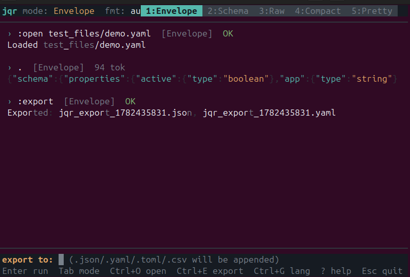
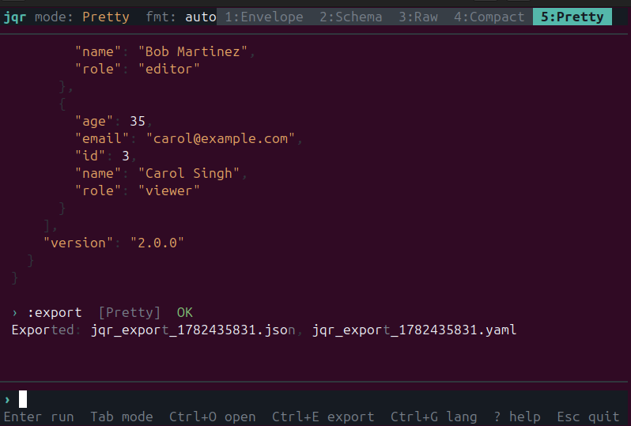

# jqr

[English](README.md) | **中文**

一个支持多种格式的数据查询工具，带交互式终端界面。

JSON、YAML、TOML、CSV — 用 `jq` 语法查询，随时切换格式，导出为任意格式。

---

## 为什么做这个工具

我每天都要处理结构化数据 — API 响应、配置文件、数据导出。我总是用 `jq` 看 JSON，再换一个工具看 YAML，再换一个看 CSV。每个工具有自己的查询语言、自己的输出格式、自己的坑。

我想要一个工具：

- **通吃所有格式。** 加载 YAML 文件，用 `jq` 语法查询，导出为 CSV。不需要转换器，不需要在工具之间来回切换。
- **有真正的界面。** 不是简单的 stdin → stdout，而是一个交互式工作台，可以输入查询、看结果、修改、对比 — 全部在终端里完成。
- **速度要快。** Rust 编译，亚毫秒启动，无运行时依赖。

## 截图





## 安装

### 从源码编译

**前置条件：** Rust 1.70+（[安装 Rust](https://rustup.rs)）

```bash
git clone https://github.com/Apageoflove/jqr.git
cd jqr
cargo build --release
```

编译后的程序在 `target/release/jqr`，复制到 PATH 中：

```bash
sudo cp target/release/jqr /usr/local/bin/
```

验证：

```bash
jqr --version
```

## 快速开始

```bash
# 查询 JSON（默认输出：schema + 数据）
echo '{"users":[{"name":"Alice"}]}' | jqr '.users[].name'

# 原始输出（和 jq 一样）
echo '{"a":1}' | jqr -r '.'

# 从文件读取
jqr -F data.json '.users | length'

# YAML 输入
jqr -I yaml -F config.yaml '.server.port'

# Token 预算（适合 LLM 上下文窗口）
echo '{"data":[1,2,3,4,5,6,7,8,9,10]}' | jqr -t 50 '.data'

# 交互模式
echo '{"users":[{"name":"Alice","age":30}]}' | jqr
```

## 支持的格式

| 格式 | 读取 | 导出 | 扩展名 |
|------|------|------|--------|
| JSON | 支持 | 支持 | `.json` |
| YAML | 支持 | 支持 | `.yaml` |
| TOML | 支持 | 支持 | `.toml` |
| CSV  | 支持 | 支持 | `.csv`  |

## 命令行参数

| 参数 | 简写 | 说明 |
|------|------|------|
| `--input <格式>` | `-I` | 输入格式：auto, json, yaml, toml, csv |
| `--output <模式>` | `-o` | 输出模式：schema, raw, compact |
| `--raw` | `-r` | 原始 JSON（和 jq 一样） |
| `--compact` | `-c` | 单行 JSON |
| `--pretty` | `-p` | 美化缩进输出 |
| `--tokens <N>` | `-t` | 输出限制在约 N 个 token |
| `--sample-size <N>` | `-n` | 采样记录数（默认 5） |
| `--schema-only` | `-S` | 只输出结构，不输出数据 |
| `--schema-format <f>` | `-f` | jsonschema, typescript, zod, pydantic |
| `--repair` | `-R` | 修复损坏的 JSON |
| `--explain` | `-x` | 分析过滤器但不执行 |
| `--file <路径>` | `-F` | 从文件读取 |
| `--interactive` | `-i` | 强制交互模式 |

## 交互模式快捷键

| 按键 | 功能 |
|------|------|
| `Enter` | 执行过滤器 |
| `Tab` | 切换输出模式 |
| `Ctrl+O` | 打开文件（任意格式） |
| `Ctrl+E` | 导出为多种格式 |
| `Ctrl+F` | 切换输入格式 |
| `Ctrl+S` | 保存当前输出 |
| `Ctrl+G` | 切换 中文 / English |
| `↑/↓` | 过滤器历史 |
| `PgUp/PgDn` | 滚动记录 |
| `Ctrl+L` | 清空记录 |
| `?` | 帮助面板 |
| `Esc` | 退出 |

## 使用示例

```bash
# JSON
echo '{"name":"Alice","age":30}' | jqr '.name'

# YAML
jqr -I yaml -F config.yaml '.server'

# TOML
cat Cargo.toml | jqr -I toml '.package.version'

# CSV
cat users.csv | jqr -I csv '.[0].name'

# 导出 Schema
jqr -S -f typescript -F api.json '.'

# JSON 修复（修复 LLM 输出的残缺 JSON）
echo 'Here is data: {"users": [{"name": "Alice"}, {"name": "Bob"' | jqr -R '.'

# jq 过滤器
echo '{"a":[1,2,3]}' | jqr '.a | length'           # 3
echo '{"a":[1,2,3]}' | jqr '.a | map(. * 2)'       # [2,4,6]
echo '{"a":1,"b":2}' | jqr 'keys'                    # ["a","b"]
```

## MCP 服务器

```bash
jqr mcp
```

添加到 MCP 客户端配置：

```json
{
  "mcpServers": {
    "jqr": { "command": "jqr", "args": ["mcp"] }
  }
}
```

## 开发

```bash
cargo build                    # 编译
cargo test                     # 运行测试
cargo clippy -- -D warnings    # 代码检查
cargo build --release          # 发布编译
./verify.sh                    # CLI 验证脚本
```

## 项目结构

```
jqr/
  src/
    main.rs            入口
    cli.rs             命令行解析
    input/             多格式读取器
    filter/            jq 过滤引擎 (jaq)
    schema/            Schema 推断
    output/            输出封装、截断、token 计数
    repair/            JSON 修复
    interactive/       终端界面 (会话、渲染、高亮)
    config/            配置 + Agent 检测
    mcp/               MCP 服务器
  test_files/          示例文件 (json/yaml/toml/csv)
  tests/               集成测试
```

## 技术栈

Rust, jaq, serde (json/yaml/toml/csv), clap, crossterm, rmcp

## 许可证

MIT
